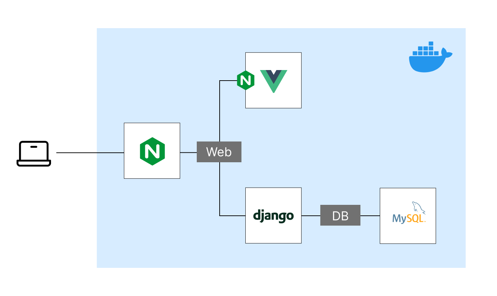
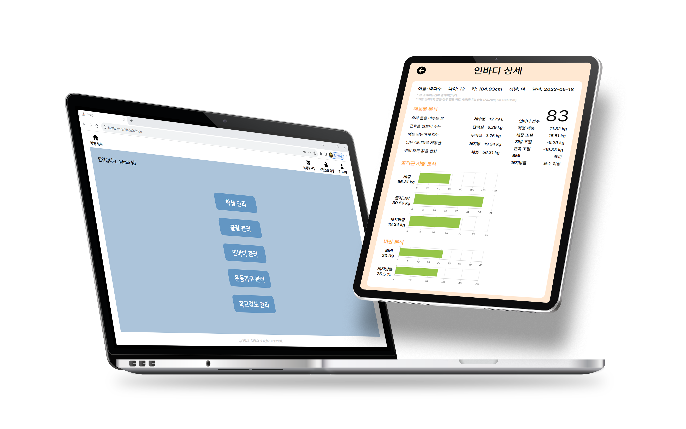
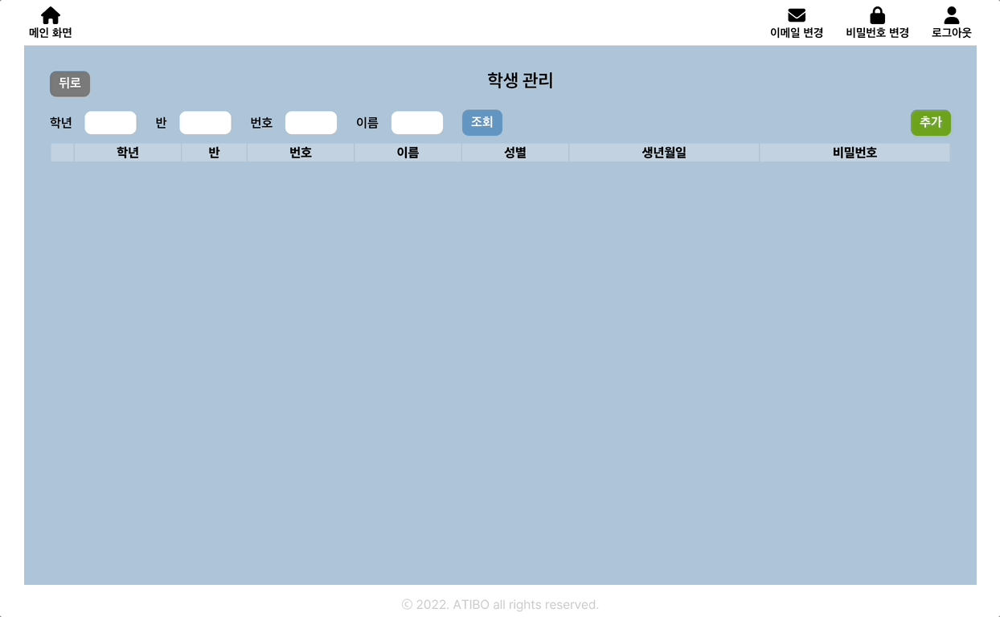
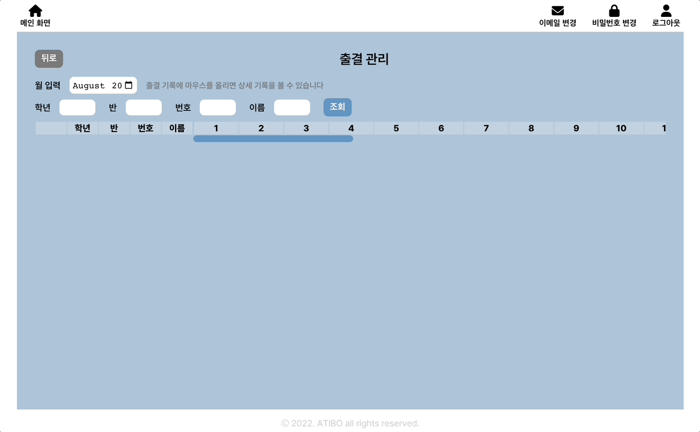
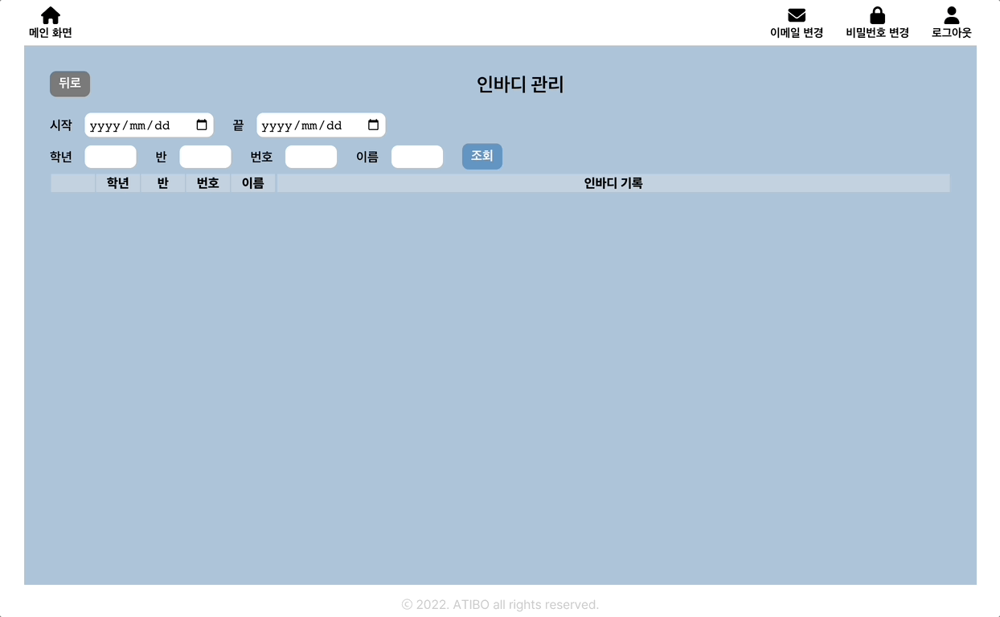
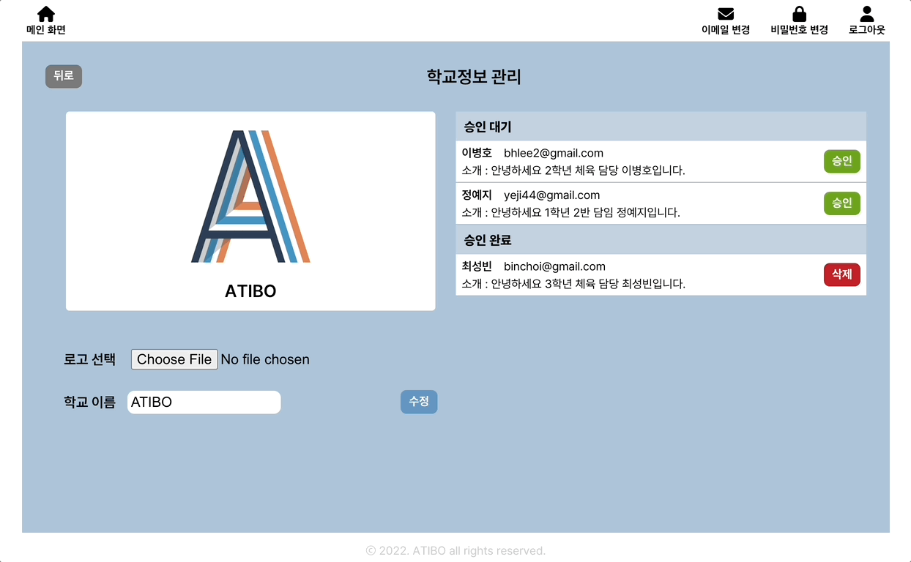
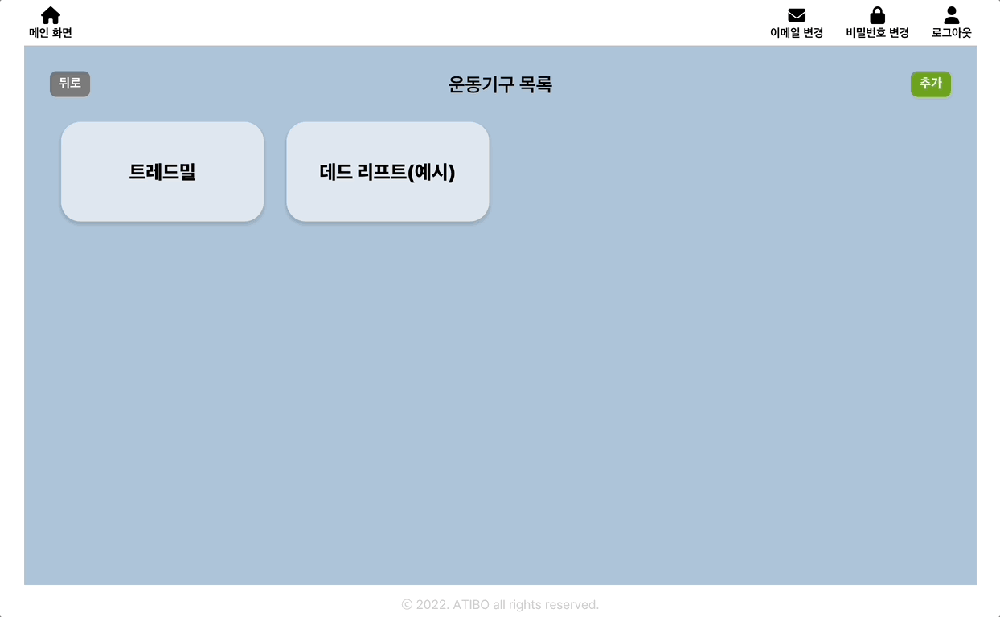

<div align="center">

# ATIBO <!-- omit in toc -->


[](https://opensource.org/licenses/MIT)

</div>

## 🔖 소개

**ATIBO | 초중고 체육 활성화를 위한 인바디 관리 솔루션**

2022년 정부는 초중고생 체력증진을 목표로 학교체육 활성화를 추진했습니다. ATIBO는 초중고 체력단련실 내의 키오스크 및 관리자 페이지를 통해 학생들의 인바디 정보를 기록하고 간편한 출결 관리 서비스를 제공하는 플랫폼입니다. 도커 컴포즈를 통해 실행 환경에 구애받지 않고 ATIBO 서비스를 이용할 수 있습니다.

**📊 키오스크**

```
학생은 키오스크를 통해 다음과 같은 기능을 이용할 수 있습니다.

1. 출석 체크
   - 수업 출석을 간편하게 등록할 수 있습니다.

2. 인바디 정보 조회
   - 자신의 인바디 정보를 조회하고 건강 상태를 파악할 수 있습니다.

3. 운동기구 정보 조회
   - 체력단련실 내의 운동기구에 대한 설명을 확인하고 올바른 사용법을 숙지할 수 있습니다.
```

**🖥️ 관리자 페이지**

```
선생님은 계정 권한에 따라 다음과 같은 기능을 이용할 수 있습니다.

1. 학생 정보 관리
   - 학생 정보를 등록, 조회, 수정할 수 있습니다.

2. 학생 출결 관리
   - 학생의 출결 기록을 조회할 수 있습니다.

3. 학생 인바디 관리
   - 학생의 인바디 정보를 등록, 수정, 삭제할 수 있습니다.
   - 인바디 정보 조회를 통해 체력 상태를 지속적으로 관찰할 수 있습니다.
```

## 🌎 다운로드 및 설치

ATIBO 웹 서비스는 총 4개의 Docker 컨테이너로 구성되어 있으며 Docker Compose로 관리할 수 있습니다. ATIBO의 모든 컨테이너는 Linux OS를 바탕으로 설계되었지만, Docker Engine이 실처되어 있다면 Windows / MacOS 환경에서도 실행할 수 있습니다.



### 사전 준비

- [Docker](https://docs.docker.com/engine/install/) 설치
- [Docker Compose](https://docs.docker.com/compose/install/) 설치
- ATIBO 웹 서비스를 호스팅하기 위해 사용할 포트를 방화벽 설정에서 열어둡니다

### 파일 다운로드

ATIBO의 Docker Compose를 실행하기 위해 필요한 파일들을 다운로드 합니다.

1. `curl`라이브러리가 설치되어 있는지 확인합니다.
   ```bash
   apt-get update
   apt-get install curl
   ```
2. 파일들을 다운로드할 디렉토리로 이동합니다. 추천하는 디렉토리는 `/opt`입니다

   ```bash
   cd /opt
   ```

3. 아래 명령어를 실행시켜 필요한 파일들을 다운로드 할 수 있습니다. 명령어의 상세 코드는 [여기](https://github.com/student-inbody-kiosk/ATIBO/blob/gh-pages/download_atibo_docker_compose.sh)에서 확인할 수 있습니다.

   ```bash
   curl https://student-inbody-kiosk.github.io/ATIBO/download_atibo_docker_compose.sh | bash
   ```

4. 명령어가 성공적으로 실행되었다면 아래와 같은 파일구조가 만들어집니다.
   ```
   /opt/atibo
           ├── docker-compose.yml
           ├── .env
           └── nginx
               ├── Dockerfile
               └── nginx.conf
   ```

### 서비스 설정

ATIBO에 대한 상세 설정은 `.env` 파일의 환경변수로 관리됩니다.

- **반드시 ATIBO 웹서비스를 제공할 컴퓨터의 공인 IP주소(`DOMAIN_OR_PUBLIC_IP`)와 포트 번호(`PORT`)를 입력해주세요**
- 보안을 위해 데이터베이스 비밀번호(`DB_PASSWORD`)를 수정해주세요
- 이메일을 통한 비밀번호 초기화 기능을 이용하기 위해서는 이메일(`EMAIL_HOST_USER`)과 이메일 비밀번호(`EMAIL_HOST_PASSWORD`)를 입력해주세요. 단, 원격 접속이 가능한 이메일이어야 합니다.

```python
# Domain name. If you do not have one, the public IP of the machine.
# For example: 198.51.100.1, or openvidu.example.com
DOMAIN_OR_PUBLIC_IP=127.0.0.1
PORT=9005

# DataBase
# Modify the password for security
DB_PASSWORD=atibo-project-123
DB_NAME=atibo
DB_USER=root
DB_HOST=atibo-db
DB_PORT=3306

# Email host
# To use password initialization, enter remote accessible email information
# https://integer-ji.tistory.com/274
EMAIL_HOST_USER=
EMAIL_HOST_PASSWORD=
EMAIL_HOST=smtp.gmail.com
EMAIL_PORT=587
```

### 서비스 실행

ATIBO를 시작하려면, `docker-compose.yml`파일이 있는 위치에서 아래 명령어를 실행시킵니다

```bash
cd /opt/atibo
docker compose -p atibo up -d
```

### 서비스 중지

- ATIBO를 일시적으로 멈추려면, 아래 명령어를 실행시킵니다.

  ```bash
  docker compose -p atibo stop
  ```

- ATIBO를 삭제하려면, 아래 명령어를 실행시킵니다. 모든 데이터와 저장공간이 백업되지 않고 사라집니다.

  ```bash
  docker compose -p atibo down -v
  ```

## 📌 사용 가이드

ATIBO는 계정을 Student, User, Admin 세 가지로 분류해 각기 다른 권한을 부여합니다.



### • Student

<div style="display:flex; gap:10px; text-align:center;">
   <div>
      <p>출석 확인</p>
      
   </div>

   <div>
      <p>인바디 조회</p>
      
   </div>

<div>
      <p>운동기구 조회</p>
      
   </div>

</div>

<br/>

### • User

<p>학생 정보 조회</p>


<p>출결 정보 조회</p>


<p>인바디 정보 조회</p>


<br/>

### • Admin

<p>학교 정보 및 계정 관리</p>


<p>운동기구 정보 관리</p>


## 😄 Contributors

<a href="https://github.com/student-inbody-kiosk/ATIBO/graphs/contributors">
  
</a>
